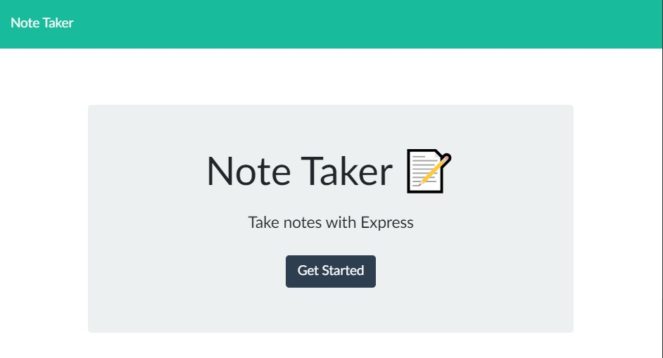
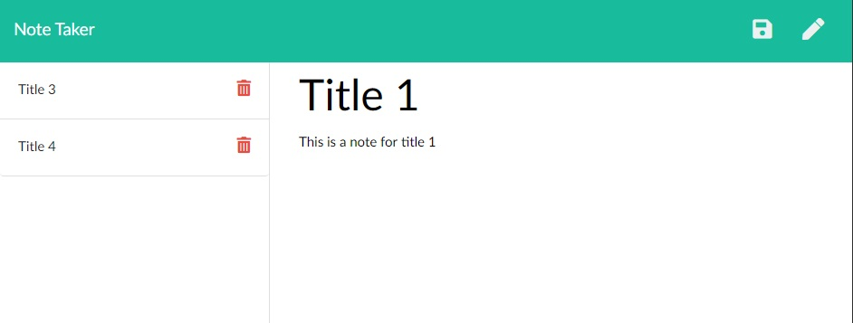

# Note Taker

  

## Table of Contents
* [Description](#description)
* [Installation](#installation)
* [Usage](#usage)
* [License](#license)
* [Contributions](#contributions)
* [Tests](#tests)
* [Contact Me](#contact-me)

## Description
Note taker is designed to be a personal assistant where the user can type a note in the right side and it will have a persistent save in a .json file on the web server.

## Installation
To install this project, you must have a computer with npm, express, and heroku on it.  Then clone the project from github, npm init it, install it to heroku, and go crazy writing notes.

## Usage
The user would type a title in to the the title box, then a note to correspond to the title and click on the save icon.  Once the note became old, they can delete it by clicking on the trash can to the right of the not title.

## License
MIT License

Copyright (c) 2020 Brent Feuerbacher

Permission is hereby granted, free of charge, to any person obtaining a copy
of this software and associated documentation files (the "Software"), to deal
in the Software without restriction, including without limitation the rights
to use, copy, modify, merge, publish, distribute, sublicense, and/or sell
copies of the Software, and to permit persons to whom the Software is
furnished to do so, subject to the following conditions:

The above copyright notice and this permission notice shall be included in all
copies or substantial portions of the Software.

THE SOFTWARE IS PROVIDED "AS IS", WITHOUT WARRANTY OF ANY KIND, EXPRESS OR
IMPLIED, INCLUDING BUT NOT LIMITED TO THE WARRANTIES OF MERCHANTABILITY,
FITNESS FOR A PARTICULAR PURPOSE AND NONINFRINGEMENT. IN NO EVENT SHALL THE
AUTHORS OR COPYRIGHT HOLDERS BE LIABLE FOR ANY CLAIM, DAMAGES OR OTHER
LIABILITY, WHETHER IN AN ACTION OF CONTRACT, TORT OR OTHERWISE, ARISING FROM,
OUT OF OR IN CONNECTION WITH THE SOFTWARE OR THE USE OR OTHER DEALINGS IN THE
SOFTWARE.

## Contributions
I am not accepting contributions at this time.

## Tests
There are no instructions for testing this project at this time.

## Contact Me
* [Email](mailto:feuerbacherb@gmail.com)

* [GitHub](https://www.github.com/feuerbacherb)
